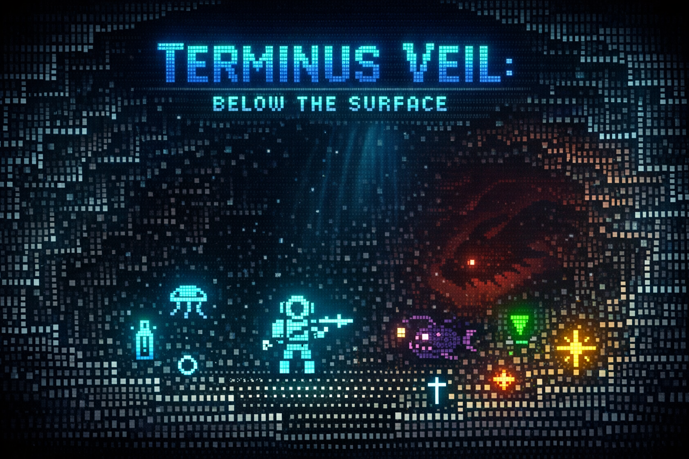

# Terminus Veil - Below the Surface

\
*A deep-sea roguelike by Nullsec0x*

Descend into the abyss. A turn-based roguelike built with Python and
Textualize, featuring procedural underwater cave generation, combat with
sea creatures, inventory management, progressive depth levels, and
immersive ASCII art visuals.

------------------------------------------------------------------------

## Features 🌊

### Core Gameplay

-   **Turn-based movement and combat** -- Move with WASD or arrow keys.
-   **Procedural cave generation** -- Every descent is unique, using a
    BSP algorithm crafted by Nullsec0x.
-   **Field of View (FOV)** -- Realistic line-of-sight with exploration
    memory, implemented by Nullsec0x.
-   **Progressive difficulty** -- Deeper zones become more dangerous,
    designed by Nullsec0x.

### Visual Design 🎨

-   **Beautiful ASCII art** -- Enhanced Unicode characters for an
    atmospheric underwater feel.
-   **Smart wall rendering** -- Rock formations use proper line-drawing
    characters (╔╗╚╝║═╬╦╩╠╣).
-   **Color-coded entities** -- Different hues for creatures, items, and
    terrain.
-   **Expressive characters** -- Diver (◉), Jellyfish (〰), Anglerfish
    (☉), Leviathan (◈).

### Combat System ⚔️

-   **Multiple creature types**: Jellyfish (〰), Anglerfish (☉),
    Leviathan (◈).
-   **Strategic combat** -- Attack by moving into creatures.
-   **Creature AI** -- Enemies pursue and attack the diver.
-   **Oxygen (health) and damage system** with visual feedback.
-   **Death remains** -- Defeated creatures become skulls (☠).

### Inventory & Equipment 🎒

-   **Collectible items**: Oxygen Tanks (⊕), Research Data (◌), Signal
    Flares (✦), Harpoon Upgrades (†).
-   **Inventory management** -- View equipment in the status panel.
-   **Item usage** -- Press **1** for Oxygen Tank, **2** for Signal
    Flare, **i** for general use.
-   **Equipment effects** -- Harpoon Upgrades increase attack power.

### Progression 

-   **Multi-depth zones** -- Descend by finding the exit (▼).
-   **Scaling difficulty** -- More creatures and items with each zone.
-   **Score system** -- Earn points for progression and combat.
-   **Persistent inventory** -- Keep items between depths.

------------------------------------------------------------------------

## Visual Elements 🖼️

### Characters

  Symbol   Entity            Color
  -------- ----------------- ---------------
  ◉        Diver             Bright Cyan
  〰       Jellyfish         Light Blue
  ☉        Anglerfish        Purple
  ◈        Leviathan         Deep Red
  ☠        Remains           Gray
  ⊕        Oxygen Tank       Cyan
  ◌        Research Data     Aqua
  ✦        Signal Flare      Bright Yellow
  †        Harpoon Upgrade   Bright White
  ▼        Descent Marker    Bright Green

### Terrain

-   **Walls** -- Rock formations drawn with smart line-characters
    (╔╗╚╝║═╬╦╩╠╣)
-   **Open water** -- Small dots (·) for visible areas, shaded (░) for
    explored
-   **Visibility** -- Full color for currently visible, dimmed for
    explored, hidden for unseen

------------------------------------------------------------------------

## Controls 🎮

  Key             Action
  --------------- -----------------------
  WASD / Arrows   Move / Attack
  **1**           Use Oxygen Tank (⊕)
  **2**           Use Signal Flare (✦)
  **i**           Use Item (general)
  **r**           Restart current depth
  **q**           Quit

------------------------------------------------------------------------

## Installation & Running 

### Requirements

-   Python 3.7+
-   Textualize library

### Setup

``` bash
# Clone the repository
git clone https://github.com/nullsec0x/terminus-veil-below-the-surface.git
cd terminus-veil

# Install dependencies
pip install textual

# Run the game
python main.py
```

### Building an Executable

``` bash
pip install pyinstaller
pyinstaller --onefile main.py
```

------------------------------------------------------------------------

## Game Mechanics ⚙️

### Combat

-   Move into a creature to attack.
-   Damage is calculated with a small random factor.
-   Creatures attack back when adjacent.
-   Defeated creatures leave remains (☠).

### Items

-   **Oxygen Tank (⊕)** -- Restores 25 oxygen.
-   **Research Data (◌)** -- Increases score.
-   **Signal Flare (✦)** -- Random effect (healing, attack boost, or
    nothing).
-   **Harpoon Upgrade (†)** -- Permanently increases harpoon strength.

### Progression

-   Find the descent marker (▼) to go deeper.
-   Each zone has more creatures and items.
-   Creature stats scale with depth.
-   Score increases with each zone.

------------------------------------------------------------------------

## Architecture 🏗️

The game is built with a modular design by Nullsec0x:

    terminus-veil/
    ├── main.py
    ├── game/
    │   ├── __init__.py
    │   ├── player.py
    │   ├── game_map.py
    │   ├── dungeon_generator.py
    │   ├── monster.py
    │   ├── combat.py
    │   ├── items.py
    │   ├── fov.py
    │   └── ascii_art.py
    └── README.md

### Key Algorithms

-   BSP Dungeon Generation
-   Shadowcasting FOV
-   Smart Wall Rendering
-   Turn-based System

### Visual Enhancements

-   Unicode Characters
-   Color Coding via Textualize
-   Smart Walls
-   Memory System (visible, explored, hidden)

------------------------------------------------------------------------

## Contributing 🤝

This project was built by Nullsec0x. Feel free to fork and extend with
ideas like: - More sea creatures and abilities - Special items and
equipment - Character upgrades or classes - Save/load functionality -
Sound effects or animations - Additional visual themes

------------------------------------------------------------------------

## License 📄

Open source -- feel free to use and modify. 

------------------------------------------------------------------------

## Credits 💡

Built with: - Textualize - Python 3 - Unicode characters
for enhanced ASCII art - Algorithms from the roguelike development
community
